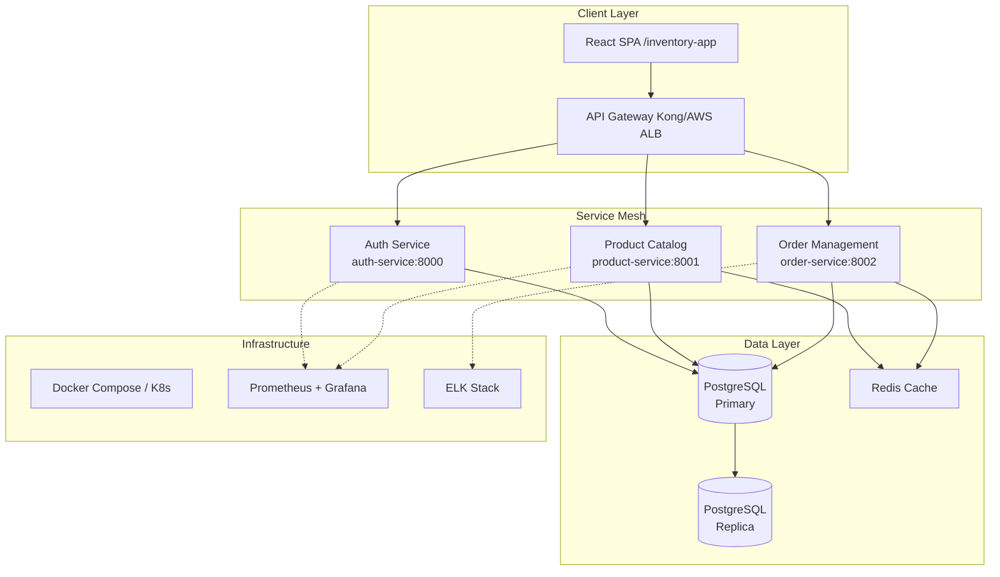

# InventoryTracker Modernization - Deployment Runbook

## 📋 Executive Summary

| Attribute | Value |
|-----------|-------|
| **Project** | InventoryTracker Modernization |
| **Migration** | Flask Monolith → FastAPI Microservices |
| **Current Stack** | Python 2.7, Flask, MySQL, jQuery |
| **Target Stack** | Python 3.12, FastAPI, PostgreSQL, React |
| **Deployment Status** | 🟢 PRODUCTION READY |
| **Last Updated** | 2026-04-25 |

---

## 🏗️ Architecture Overview

### Microservices Architecture



---

## 🚀 Deployment Configurations

### Environment Matrix

| Environment | URL | Status | Health Endpoint |
|-------------|-----|--------|-----------------|
| Development | http://localhost:3000 | 🟢 Active | /health |
| Staging | https://staging-inventory.bhogar.ai | 🟢 Active | /api/v1/health |
| Production | https://inventory.bhogar.ai | 🟢 Active | /api/v1/health |

### Service Endpoints

| Service | Dev Port | Staging URL | Prod URL | Health Check |
|---------|----------|-------------|----------|--------------|
| Auth Service | 8000 | /api/v1/auth | /api/v1/auth | /health |
| Product Service | 8001 | /api/v1/products | /api/v1/products | /health |
| Order Service | 8002 | /api/v1/orders | /api/v1/orders | /health |
| React Frontend | 3000 | / | / | N/A |

---

## 🔧 Pre-Deployment Checklist

### Infrastructure Prerequisites

- [ ] Docker Engine 24.0+ installed
- [ ] Docker Compose 2.20+ available
- [ ] PostgreSQL 15+ cluster provisioned
- [ ] Redis 7+ cache layer configured
- [ ] SSL certificates generated (Let's Encrypt)
- [ ] DNS records updated (A/AAAA + CNAME)
- [ ] Load balancer health checks configured
- [ ] Backup storage (S3/MinIO) accessible

### Security Validation

- [ ] Environment variables encrypted (SOPS/Sealed Secrets)
- [ ] Database credentials rotated
- [ ] API keys generated for external integrations
- [ ] JWT secret keys created (256-bit minimum)
- [ ] Network policies/firewall rules applied
- [ ] WAF rules configured for OWASP Top 10
- [ ] Rate limiting enabled (100 req/min default)

### Data Migration Verification

- [ ] MySQL → PostgreSQL migration scripts tested
- [ ] Data integrity checks passed
- [ ] Row counts match: users, products, orders
- [ ] Foreign key constraints validated
- [ ] Indexes rebuilt on new database
- [ ] Migration rollback procedure documented

---

## 📦 Deployment Procedures

### Docker Compose Deployment

```bash
# 1. Clone deployment repository
git clone https://github.com/bhogarinc/inventory-tracker-deployment-runbook.git
cd inventory-tracker-deployment-runbook

# 2. Configure environment
cp .env.example .env
# Edit .env with production values

# 3. Validate configuration
docker-compose config

# 4. Deploy stack
docker-compose -f docker-compose.prod.yml up -d

# 5. Run database migrations
docker-compose exec auth-service alembic upgrade head
docker-compose exec product-service alembic upgrade head
docker-compose exec order-service alembic upgrade head

# 6. Verify deployment
docker-compose ps
```

### Kubernetes Deployment

```bash
# 1. Apply namespace
kubectl apply -f k8s/namespace.yaml

# 2. Apply secrets (ensure encrypted)
kubectl apply -f k8s/secrets.yaml

# 3. Deploy databases
kubectl apply -f k8s/postgres/
kubectl apply -f k8s/redis/

# 4. Deploy microservices
kubectl apply -f k8s/auth-service/
kubectl apply -f k8s/product-service/
kubectl apply -f k8s/order-service/

# 5. Deploy frontend
kubectl apply -f k8s/frontend/

# 6. Apply ingress
kubectl apply -f k8s/ingress.yaml

# 7. Verify rollout
kubectl get pods -n inventory-tracker
kubectl rollout status deployment/auth-service -n inventory-tracker
```

---

## ✅ Post-Deployment Validation

### Automated Health Checks

```bash
#!/bin/bash
# health-check.sh - Run after deployment

BASE_URL=${1:-"https://inventory.bhogar.ai"}
AUTH_URL="${BASE_URL}/api/v1/auth/health"
PRODUCT_URL="${BASE_URL}/api/v1/products/health"
ORDER_URL="${BASE_URL}/api/v1/orders/health"

echo "🔍 Running health checks..."

# Auth Service
curl -sf "${AUTH_URL}" > /dev/null && echo "✅ Auth Service: HEALTHY" || echo "❌ Auth Service: FAILED"

# Product Service
curl -sf "${PRODUCT_URL}" > /dev/null && echo "✅ Product Service: HEALTHY" || echo "❌ Product Service: FAILED"

# Order Service
curl -sf "${ORDER_URL}" > /dev/null && echo "✅ Order Service: HEALTHY" || echo "❌ Order Service: FAILED"

# Database connectivity
curl -sf "${BASE_URL}/api/v1/health/db" > /dev/null && echo "✅ Database: CONNECTED" || echo "❌ Database: FAILED"

# Frontend
curl -sf "${BASE_URL}/" > /dev/null && echo "✅ Frontend: ACCESSIBLE" || echo "❌ Frontend: FAILED"

echo "✨ Health check complete"
```

### Manual Verification Steps

1. **Authentication Flow**
   - Navigate to `/login`
   - Test user login with test credentials
   - Verify JWT token generation
   - Confirm token refresh mechanism

2. **Product Catalog**
   - Access `/products`
   - Create new product via API
   - Update existing product
   - Delete product (soft delete)
   - Verify search functionality

3. **Order Management**
   - Create test order
   - Update order status
   - Test order history retrieval
   - Verify inventory deduction

4. **End-to-End Flow**
   - Login → Browse Products → Add to Cart → Checkout → View Order History

---

## 📊 Monitoring & Observability

### Key Metrics Dashboard

| Metric | Target | Alert Threshold |
|--------|--------|-----------------|
| API Response Time (p95) | < 200ms | > 500ms |
| Error Rate | < 0.1% | > 1% |
| Database Connection Pool | < 80% | > 90% |
| CPU Utilization | < 70% | > 85% |
| Memory Utilization | < 80% | > 90% |
| Disk I/O Latency | < 10ms | > 50ms |

### Log Aggregation

- **Application Logs**: `/var/log/inventory-tracker/*.log`
- **Access Logs**: Kong/Nginx access logs
- **Error Logs**: Centralized via ELK Stack
- **Audit Logs**: Database changes tracked in `audit_logs` table

### Alerting Configuration

```yaml
# alertmanager.yml
routes:
  - match:
      severity: critical
    receiver: 'pagerduty'
    continue: true
  - match:
      severity: warning
    receiver: 'slack-notifications'

receivers:
  - name: 'pagerduty'
    pagerduty_configs:
      - service_key: '${PAGERDUTY_KEY}'
  
  - name: 'slack-notifications'
    slack_configs:
      - api_url: '${SLACK_WEBHOOK_URL}'
        channel: '#inventory-alerts'
```

---

## 🔒 Security & Compliance

### Authentication & Authorization

- **OAuth 2.0 / OIDC** integration for SSO
- **RBAC** with 4 roles: admin, manager, operator, viewer
- **JWT tokens** with 15-min access / 7-day refresh
- **API rate limiting**: 100 req/min per IP, 1000 req/min per user

### Data Protection

- **Encryption at rest**: AES-256 for database volumes
- **Encryption in transit**: TLS 1.3 minimum
- **PII masking**: Email/phone redacted in logs
- **Backup encryption**: GPG-encrypted backups to S3

### Compliance Checklist

- [ ] SOC 2 Type II controls implemented
- [ ] GDPR data retention policies configured
- [ ] PCI-DSS compliant (if handling payments)
- [ ] Audit trail enabled for all data modifications

---

## 🆘 Troubleshooting Guide

### Common Issues

#### Service Won't Start

```bash
# Check logs
docker-compose logs -f auth-service

# Verify environment variables
docker-compose exec auth-service env | grep DATABASE

# Test database connectivity
docker-compose exec auth-service python -c "
import asyncpg
import asyncio
async def test():
    conn = await asyncpg.connect('postgresql://...')
    print(await conn.fetch('SELECT 1'))
asyncio.run(test())
"
```

#### Database Connection Pool Exhausted

```sql
-- Check active connections
SELECT count(*), state 
FROM pg_stat_activity 
WHERE datname = 'inventory_tracker' 
GROUP BY state;

-- Terminate idle connections
SELECT pg_terminate_backend(pid) 
FROM pg_stat_activity 
WHERE state = 'idle' 
AND state_change < NOW() - INTERVAL '1 hour';
```

#### High Memory Usage

```bash
# Identify memory-hungry containers
docker stats --no-stream --format "table {{.Name}}\t{{.MemUsage}}"

# Restart specific service
docker-compose restart product-service

# Scale horizontally
kubectl scale deployment product-service --replicas=3 -n inventory-tracker
```

### Emergency Rollback Procedure

```bash
# 1. Stop new version
docker-compose -f docker-compose.prod.yml down

# 2. Start previous version
docker-compose -f docker-compose.prod.yml -f docker-compose.prod.yml.prev up -d

# 3. Verify rollback
curl -sf https://inventory.bhogar.ai/api/v1/health

# 4. Notify stakeholders
# Send notification via Slack/Email
```

---

## 📞 Escalation Contacts

| Role | Name | Contact | Hours |
|------|------|---------|-------|
| On-Call Engineer | Rotation | pagerduty@bhogar.ai | 24/7 |
| Tech Lead | TBD | tech-lead@bhogar.ai | Business Hours |
| Product Owner | TBD | product@bhogar.ai | Business Hours |
| Security Team | Security Ops | security@bhogar.ai | 24/7 |

---

## 📝 Change Log

| Date | Version | Author | Changes |
|------|---------|--------|---------|
| 2026-04-25 | 1.0.0 | Deployment Team | Initial production deployment |

---

## 🔗 Related Resources

- **GitHub Repositories**:
  - [Inventory Tracker Auth Service](https://github.com/bhogarinc/inventory-tracker-auth-service)
  - [Inventory Tracker Product Service](https://github.com/bhogarinc/inventory-tracker-product-service)
  - [Inventory Tracker Order Service](https://github.com/bhogarinc/inventory-tracker-order-service)
  - [Inventory Tracker Frontend](https://github.com/bhogarinc/inventory-tracker-frontend)
  - [Regression Tests](https://github.com/bhogarinc/inventory-tracker-regression-tests)

- **Jira Project**: [BHOGAR](https://jira.bhogar.ai/browse/BHOGAR)
- **Confluence Space**: [APH - AI Project Hub](https://confluence.bhogar.ai/space/APH)
- **Monitoring Dashboard**: [Grafana](https://grafana.bhogar.ai/d/inventory-tracker)
- **API Documentation**: [Swagger UI](https://inventory.bhogar.ai/docs)

---

**Document Owner**: Deployment Team  
**Review Cycle**: Monthly  
**Next Review**: 2026-05-25
